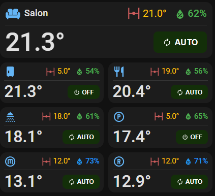

# HA Thermostat Card

A simple, elegant thermostat card for Home Assistant that displays temperature, humidity, valve status, and heating mode in a compact format.

[](https://github.com/hacs/integration)

## Screenshot



## Features

- **Current Temperature** - Large, prominent display (45px normal, 29px compact)
- **Target Temperature** - Shows setpoint with valve status indicator
- **Humidity** - Color-coded display based on configurable thresholds
- **Valve Status** - Visual indicator for valve position (0-100%)
- **HVAC Mode** - Shows current mode (AUTO/MANUAL/BOOST/OFF) with tap actions
- **Heating Indicator** - Orange border when heating is needed
- **Presence Detection** - Red badge indicator when presence detected
- **Compact Layout** - Half-width mode perfect for grid layouts
- **Tap Actions** - Customizable tap/hold/double-tap on mode button

## Installation

### HACS (Recommended)

1. Open HACS in Home Assistant
2. Go to "Frontend" section
3. Click the three dots menu and select "Custom repositories"
4. Add this repository URL with category "Lovelace"
5. Install "Thermostat Card"
6. Refresh your browser

### Manual Installation

1. Download `ha-clim-card.js`
2. Copy to `/config/www/ha-clim-card/ha-clim-card.js`
3. Add the resource:

```yaml
resources:
  - url: /local/ha-clim-card/ha-clim-card.js
    type: module
```

## Quick Start

### 1. Create Template Sensor

Add to your `configuration.yaml` (or separate template file):

```yaml
template:
  - sensor:
      - name: "Living Room Thermostat"
        state: "{{ states('sensor.living_room_temperature') }}"
        unit_of_measurement: "°C"
        icon: "mdi:sofa"
        attributes:
          room_name: "Living Room"
          target_temp: "{{ states('sensor.living_room_target') }}"
          humidity: "{{ states('sensor.living_room_humidity') }}"
          valve: "{{ states('sensor.living_room_valve') }}"
          mode: "{{ states('input_select.heater_mode_living') }}"
          boost: "{{ states('input_boolean.heater_boost_living') }}"
          heating_needed: "{{ is_state('binary_sensor.living_room_heating', 'on') }}"
          presence: "{{ states('binary_sensor.living_room_presence') }}"
```

### 2. Add Card to Lovelace

**Normal Layout:**
```yaml
type: custom:ha-clim-card
entity: sensor.living_room_thermostat
```

**Compact Layout (half width):**
```yaml
type: custom:ha-clim-card
entity: sensor.living_room_thermostat
layout: compact
```

**Side-by-Side Compact:**
```yaml
type: grid
columns: 2
cards:
  - type: custom:ha-clim-card
    entity: sensor.living_room_thermostat
    layout: compact
  - type: custom:ha-clim-card
    entity: sensor.bedroom_thermostat
    layout: compact
```

## Configuration Options

| Option | Type | Default | Description |
|--------|------|---------|-------------|
| `entity` | string | **Required** | Template sensor with all data as attributes |
| `layout` | string | `normal` | Layout mode: `normal` or `compact` (half width) |
| `room_icon` | string | `mdi:sofa` | Override icon from entity attributes |
| `room_name` | string | - | Override name from entity attributes (hidden in compact) |
| `show_humidity` | boolean | `true` | Show humidity display |
| `show_target` | boolean | `true` | Show target temperature with valve |
| `show_mode` | boolean | `true` | Show HVAC mode button |
| `show_heating_badge` | boolean | `true` | Show heating indicator (orange border) |
| `humidity_low` | number | `40` | Below this = orange color (too dry) |
| `humidity_high` | number | `70` | Above this = blue color (too humid) |
| `mode_tap_action` | object | - | Action when tapping mode button |
| `mode_hold_action` | object | - | Action when holding mode button (500ms) |
| `mode_double_tap_action` | object | - | Action when double-tapping mode button |

### Template Sensor Attributes

| Attribute | Required | Description |
|-----------|----------|-------------|
| `state` | ✓ | Current temperature (main sensor state) |
| `icon` | | Room icon (default: `mdi:sofa`) |
| `room_name` | | Room display name (shown in normal layout) |
| `target_temp` | | Target temperature setpoint |
| `humidity` | | Current humidity percentage |
| `valve` | | Valve position 0-100 (affects icon: closed/partial/open) |
| `mode` | | Heating mode: `off`, `auto`, `manual` |
| `boost` | | Boost state: `on` or `off` |
| `heating_needed` | | Boolean/string for orange border indicator |
| `presence` | | Presence state: `on` shows red badge on icon |

## Layout Modes

### Normal Layout (Default)
- Full width display
- Shows room icon + name
- Large temperature (45px)
- Full-size mode button

### Compact Layout
- Half width (perfect for 2-column grids)
- Shows room icon only (no name)
- Smaller temperature (29px)
- Smaller mode button (20% reduced)
- All header elements 5% smaller

**Usage:**
```yaml
type: custom:ha-clim-card
entity: sensor.room_thermostat
layout: compact  # or 'normal' (default)
```

## Visual Indicators

### Temperature
- **Display**: Shows as `22.8°` (no "C")
- **Color**: White text
- **Size**: 45px (normal), 29px (compact)

### Humidity
- **Orange** (< 40%): Too dry
- **Green** (40-70%): Comfortable
- **Blue** (> 70%): Too humid

### Valve Icon
- **🔴 Closed** (0%): Red valve-closed icon
- **🟠 Partial** (1-99%): Orange valve icon
- **🟢 Open** (100%): Green valve-open icon

### Mode Button Colors
- **AUTO**: Dark green `#132F09` (normal), `#132F09` (compact)
- **MANUAL**: Yellow `#ffc107` with black text
- **BOOST**: Orange `#ff9800`
- **OFF**: Grey `#666`
- **HEAT**: Red `#f44336`
- **COOL**: Blue `#2196f3`

### Heating Indicator
Orange border appears around card when `heating_needed` attribute is true/on.

### Presence Badge
Red motion sensor icon (🔴) appears in top-right of room icon when `presence` attribute is `on`.

## Mode Button Actions

### Tap Actions
```yaml
mode_tap_action:
  action: navigate
  navigation_path: "#popup-thermostat"
```

### Supported Action Types

| Action | Description | Example |
|--------|-------------|---------|
| `navigate` | Navigate to dashboard path | `navigation_path: "/lovelace/climate"` |
| `more-info` | Show entity more-info | `entity: input_select.heater_mode` |
| `call-service` | Call HA service | `service: climate.set_temperature` |
| `toggle` | Toggle entity | `entity: input_boolean.boost` |
| `url` | Open external URL | `url_path: "https://example.com"` |
| `fire-dom-event` | Fire custom event | For browser_mod popups |
| `none` | Do nothing | - |

### Example: Browser Mod Popup
```yaml
mode_tap_action:
  action: fire-dom-event
  browser_mod:
    service: browser_mod.popup
    data:
      title: "Climate Control"
      content:
        type: entities
        entities:
          - input_select.heater_mode
          - input_boolean.heater_boost
          - input_number.target_temp
```

### Example: Service Call
```yaml
mode_hold_action:
  action: call-service
  service: input_boolean.toggle
  service_data:
    entity_id: input_boolean.heater_boost
```

## Complete Examples

### Full-Featured Room
```yaml
template:
  - sensor:
      - name: "Salon Thermostat"
        state: "{{ states('sensor.th_sal_temperature') }}"
        unit_of_measurement: "°C"
        icon: "mdi:sofa"
        attributes:
          room_name: "Salon"
          target_temp: "{{ states('sensor.nr_target_temp_salon') }}"
          humidity: "{{ states('sensor.th_sal_humidity') }}"
          valve: "{{ states('sensor.valve_sal_position') }}"
          mode: "{{ states('input_select.heater_mode_sal') }}"
          boost: "{{ states('input_boolean.heater_boost_sal') }}"
          heating_needed: "{{ states('sensor.heat_computed_states')[2] == '+' }}"
          presence: "{{ states('binary_sensor.radardetector1_presence') }}"
```

```yaml
type: custom:ha-clim-card
entity: sensor.salon_thermostat
humidity_high: 70
mode_tap_action:
  action: navigate
  navigation_path: "#popup-tempsal"
```

### Compact Grid Layout
```yaml
type: grid
columns: 2
square: false
cards:
  - type: custom:ha-clim-card
    entity: sensor.cuisine_thermostat
    layout: compact
  - type: custom:ha-clim-card
    entity: sensor.sam_thermostat
    layout: compact
  - type: custom:ha-clim-card
    entity: sensor.sdb_thermostat
    layout: compact
  - type: custom:ha-clim-card
    entity: sensor.parents_thermostat
    layout: compact
```

### Simple Temperature Display
```yaml
type: custom:ha-clim-card
entity: sensor.garage_thermostat
show_humidity: false
show_target: false
show_mode: false
show_heating_badge: false
```

## Tips

### Room Icons
- 🛋️ `mdi:sofa` - Living room
- 🍴 `mdi:silverware-fork-knife` - Dining room
- 🍳 `mdi:fridge-industrial` - Kitchen
- 🛏️ `mdi:bed` - Bedroom
- 🚿 `mdi:shower-head` - Bathroom
- 👔 `mdi:hanger` - Dressing room
- 🏠 `mdi:home` - Generic room

### Humidity Thresholds
- **Living spaces**: 40-70% (default)
- **Bathroom**: 40-80% (higher tolerance)
- **Bedroom**: 40-60% (narrower range for comfort)

### Heating Logic Examples
```yaml
# Simple binary sensor check
heating_needed: "{{ is_state('binary_sensor.room_heating', 'on') }}"

# Check specific character in computed string
heating_needed: "{{ states('sensor.heat_computed_states')[2] == '+' }}"

# Temperature difference check
heating_needed: "{{ (states('sensor.target_temp') | float) > (states('sensor.current_temp') | float) + 0.5 }}"

# Complex logic with multiple conditions
heating_needed: >
  {{ (states('sensor.target_temp') | float) > (states('sensor.current_temp') | float)
     and is_state('input_select.heater_mode', 'auto')
     and is_state('binary_sensor.presence', 'on') }}
```

## Changelog

### v2.1.2
- Removed "C" from temperature display (shows "22.8°" instead of "22.8°C")
- Fixed room icon to bright blue `#64b5f6` (no longer changes with presence)
- Added presence badge (red motion sensor icon, top-right of room icon)
- Darkened AUTO mode button colors for better dark mode visibility
- Cleaned up redundant CSS comments

### v2.1.0
- Added compact layout mode (half width)
- Adjusted compact sizing: 29px temp, smaller buttons, 5% header reduction

### v2.0.0
- Removed legacy mode (individual entities)
- Now requires single template sensor entity
- Updated humidity defaults: 40/70 (was 30/60)
- Added validation: humidity_high must be > humidity_low
- Simplified configurator

## License

MIT License
